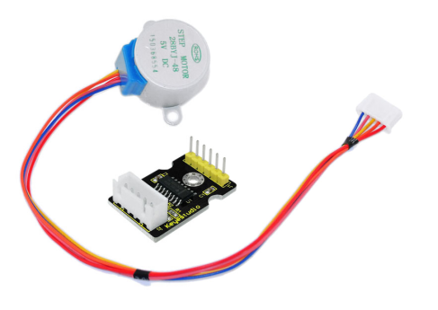
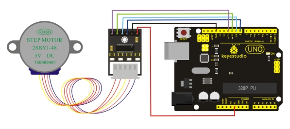
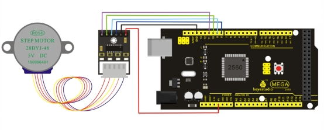

# KS0208 keyestudio ULN2003 Stepper Motor Driver



## 1. Introduction

A stepper motor is an electromechanical device which converts electrical pulses into discrete mechanical movements.

The shaft or spindle of a stepper motor rotates in discrete step increments when electrical command pulses are applied to it in the proper sequence.

The motors rotation has several direct relationships to these applied input pulses. The sequence of the applied pulses is directly related to the direction of motor shafts rotation. The speed of the motor shafts rotation is directly related to the frequency of the input pulses and the length of rotation is directly related to the number of input pulses applied.

One of the most significant advantages of a stepper motor is its ability to be accurately controlled in an open loop system. Open loop control means no feedback information about position is needed. This type of control eliminates the need for expensive sensing and feedback devices such as optical encoders. Your position is known simply by keeping track of the input step pulses.

## 2. Features

- The rotation angle of the motor is proportional to the input pulse.
- The motor has full torque at standstill(if the windings are energized)
- Precise positioning and repeatability of movement since good stepper motors have an accuracy of – 5% of a step and this error is non cumulative from one step to the next.
- Excellent response to starting/stopping/reversing.
- Very reliable since there are no contact brushes in the motor. Therefore the life of the motor is simply dependant on the life of the bearing.
- The motors response to digital input pulses provides open-loop control, making the motor simpler and less costly to control.
- It is possible to achieve very low speed synchronous rotation with a load that is directly coupled to the shaft.
- A wide range of rotational speeds can be realized as the speed is proportional to the frequency of the input pulses.

**Stepper motor 28BYJ-48 Parameters:**

- Model: 28BYJ-48
- Rated voltage: 5VDC
- Number of Phase: 4
- Speed Variation Ratio: 1/64
- Stride Angle: 5.625° /64
- Frequency: 100Hz
- DC resistance: 50Ω±7%(25℃)
- Idle In-traction Frequency: > 600Hz
- Idle Out-traction Frequency: > 1000Hz
- In-traction Torque >34.3mN.m(120Hz)
- Self-positioning Torque >34.3mN.m
- Friction torque: 600-1200 gf.cm
- Pull in torque: 300 gf.cm
- Insulated resistance >10MΩ(500V)
- Insulated electricity power: 600VAC/1mA/1s
- Insulation grade: A
- Rise in Temperature <40K(120Hz)
- Noise <35dB(120Hz,No load,10cm)

## 3. Connection Method

**Connection for UNO R3:**



**Connection for 2560 R3:**



## 4. Sample Program

Download  Resources :  [Resources](./Resources.7z)

Note： before uploading the code, you need to import the library files; otherwise, the code upload will fail.

```c
#include <Stepper.h>   
#define STEPS 100  
Stepper stepper(STEPS, 8, 9, 10, 11);  
int previous = 0;  

void setup()
{
   stepper.setSpeed(90);
} 

void loop()
{    
   int val = analogRead(0);      
   stepper.step(val - previous);     
   previous = val;
}
```

